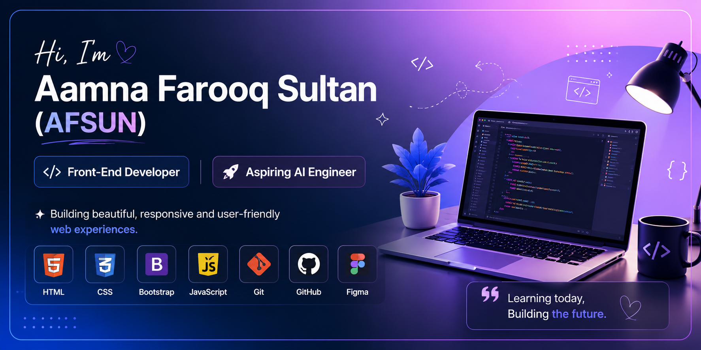

  

## Hi there 👋
# Hi there, I'm Aamna Farooq Sultan (AFSUN) 👋

### 💻 Front-End Developer
### 🤖 Aspiring AI Engineer
### 🌱 Currently Learning JavaScript

Welcome to my GitHub Profile! ✨
## 🛠️ Tech Stack

  

I enjoy building clean and modern web interfaces using HTML, CSS, Bootstrap, and JavaScript. My goal is to continue growing as a developer and become an AI Engineer in the future.

- 🌐 Front-End Development
- 🎨 UI Design with Figma
- 📚 Always Learning New Technologies
- 🚀 Building Projects Every Day
<!--
**amnafarooqfarooqsultan-a11y/amnafarooqfarooqsultan-a11y** is a ✨ _special_ ✨ repository because its `README.md` (this file) appears on your GitHub profile.

Here are some ideas to get you started:

- 🔭 I’m currently working on ...
- 🌱 I’m currently learning ...
- 👯 I’m looking to collaborate on ...
- 🤔 I’m looking for help with ...
- 💬 Ask me about ...
- 📫 How to reach me: ...
- 😄 Pronouns: ...
- ⚡ Fun fact: ...
-->
